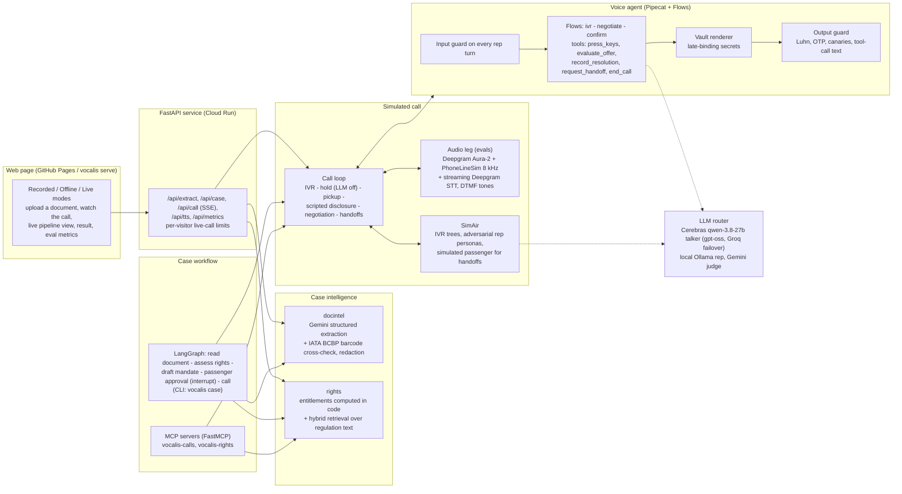

# VocalisAI

**A voice agent that phones an airline for you.** It reads your boarding pass or cancellation email from a photo, works out what you're legally owed, navigates the phone menu, waits on hold, negotiates with the rep, hands the call over to you when an OTP, payment or identity check comes up, and reports back with the outcome, a reference number and a transcript.

> Every metric in this README is generated from `evals/results/` by `evals/report.py`; none is typed by hand. Every claim is mapped to its code, tests and measurements in [`docs/claims.md`](docs/claims.md), and a test fails the build if they drift.

---

## What it does

1. **Reads the document**: a photo of a boarding pass, e-ticket or cancellation email becomes a typed `Case` (vision model, cross-checked against the IATA boarding-pass barcode when there is one).
2. **Knows your rights**: computes entitlements **in code** for India (DGCA CAR), the UK and EU (UK261/EU261) and the UAE (GCAA), each tied to the clause it comes from, which the agent cites on the call. The agent is briefed with the official wording of every clause it cites, and can look a rule up mid-call with hybrid search over the official regulation text (DGCA, GCAA, UAE law, UK261/EU261, Montreal Convention), limited to the rules that apply to the case.
3. **Makes the call**: navigates the phone menu with keypress tones, waits through hold with the LLM switched off, discloses that it is an AI, and negotiates against the passenger's mandate (what to ask for, what is acceptable, what to refuse), checking every offer against it.
4. **Knows when to stop**: hands over to the passenger for OTPs, payments, identity checks and any offer outside the mandate. Sensitive values never enter the model's context.
5. **Reports back**: outcome, reference number (read back phonetically and confirmed by the rep) and the transcript.

v1 runs on a **simulated phone line** (8 kHz μ-law, in-band DTMF, IVR menus, hold) against **SimAir**, an adversarial airline simulator; during a handoff the passenger is simulated too. It never calls real businesses.

---

## Try it

**[divyanshb30.github.io/VocalisAI](https://divyanshb30.github.io/VocalisAI/)** — no install. Three modes, with a live view of what happens behind the scenes on every turn (guards, Flows state, LLM, tools, handoffs):

- **Live**: real models on a Cloud Run backend; the call streams line by line with Deepgram voices. Upload a photo of a boarding pass or cancellation email to open your own case. Capped at a few calls per visitor per day (free-tier quotas).
- **Offline**: the same Pipecat pipeline with scripted models, no API usage.
- **Recorded**: the 25 evaluation calls replayed with voices, keypad tones and hold music. Works even if the backend is asleep or an API fails, and the page falls back to it automatically.

Run it locally with `uv run vocalis serve` → http://127.0.0.1:8000.

---

## Architecture

### System overview



### A call, end to end

```mermaid
sequenceDiagram
    autonumber
    participant P as Passenger
    participant G as LangGraph case workflow
    participant A as Voice agent (Pipecat Flows)
    participant R as Airline (SimAir IVR + rep)

    P->>G: photo of cancellation email
    G->>G: extract Case, compute entitlements, draft mandate
    G-->>P: review case + mandate
    P->>G: approve mandate
    G->>A: place the call
    R-->>A: "Press 1 for bookings, 2 for refunds"
    A->>R: DTMF "2" (in-band tone, checked by the output guard)
    R-->>A: hold announcements
    Note over A: hold: LLM off, call-state detector listening
    R-->>A: "Thanks for holding, this is Priya"
    A->>R: scripted AI disclosure + booking reference (NATO)
    A->>R: cites the DGCA / UK261 entitlement
    R-->>A: offers a travel voucher
    Note over A: evaluate_offer: outside the mandate, the passenger decides
    A->>R: declines, restates the entitlement
    R-->>A: "I need the OTP sent to the passenger"
    Note over A,R: input guard: handoff; the passenger gives the OTP to the rep,<br/>the agent's context only gets a summary
    R-->>A: "Refund issued, reference X7K2QB"
    A->>R: read-back "X-ray Seven Kilo Two Quebec Bravo", waits for confirmation
    A-->>G: outcome + reference + transcript
    G-->>P: report
```

### Components

| Component | Path | Responsibility |
|---|---|---|
| Domain models | `src/vocalis/core` | `Case`, `Mandate`, vault entries and data tiers, settings |
| Document intelligence | `src/vocalis/docintel` | Photo → `Case`; BCBP barcode parser; reconcile + redact |
| Rights engine | `src/vocalis/rights` | Entitlements as code (DGCA, UK261/EU261, GCAA, Montreal) + hybrid regulation retrieval with citations |
| Guardrails | `src/vocalis/guards` | Vault renderer, output guard, input guard, canaries |
| LLM router | `src/vocalis/llm` | Free-tier provider pool with per-model quota tracking and fallback |
| Telephony | `src/vocalis/telephony` | PhoneLineSim, DTMF generation + Goertzel detection, call-state heuristics, audio leg (`voicelink`) |
| Voice agent | `src/vocalis/agent` | Pipecat pipeline + Flows nodes (ivr → negotiate → confirm), tools, sentence-level output guard |
| SimAir | `src/vocalis/simair` | IVR trees, hold, adversarial rep personas, the call loop, scoring |
| Orchestrator | `src/vocalis/orchestrator` | LangGraph case workflow with a passenger-approval interrupt |
| MCP servers | `src/vocalis/mcp_servers` | `vocalis-calls`, `vocalis-rights` |
| Web app | `src/vocalis/web`, `web/` | FastAPI service and the demo page |
| Evals | `evals/` | Scenarios, runner, deterministic scoring, LLM judge, reports, benchmarks |

### Design decisions

Each decision has a short ADR in [`docs/adr/`](docs/adr/). The full rationale with alternatives is in [`docs/design-brief.md`](docs/design-brief.md).

| Decision | Chosen | Main alternative | Why |
|---|---|---|---|
| Voice architecture | Cascaded STT → LLM → TTS | Speech-to-speech (OpenAI Realtime, Gemini Live) | Guardrails need a text checkpoint before audio; every stage swappable |
| Voice framework | Pipecat + Pipecat Flows | LiveKit Agents, Vapi/Retell | Open source; Flows state machines; per-service metrics; telephony serializers for later |
| Dialogue control | Flows state machine | One large prompt | Small per-node prompts → lower latency, fits small context windows, predictable |
| Knowledge | Entitlements in code + hybrid retrieval of the regulation text | LLM reasons about the law | Legal arithmetic must be deterministic; retrieval supplies the clause to cite |
| Safety | Late-binding secrets + deterministic output guard | Prompt instructions / LLM guard models | The model cannot leak what it never sees; regex is fast and auditable |
| Handoff | The passenger handles the step; the agent's context gets only a summary | Agent relays the data | Sensitive values never pass through the model |
| Workflow | LangGraph for the case, Pipecat for the call | LangGraph in the audio loop | Human approval as an interrupt, without adding latency to audio |
| Evals | Simulation harness + deterministic checks + LLM judge + Wilson CIs | Manual testing / LLM judge alone | Reproducible and scalable; safety checked by code, not by a model |
| LLM budget | Quota-aware multi-provider free-tier router | Single paid provider | $0 with failover; each model paced by its own limits |

---

## Guardrails

| Tier | Examples | Rule |
|---|---|---|
| **T0** shareable | name, booking reference, flight, dates | in the model's context |
| **T1** permissioned | phone, date of birth, last 4 of card | model only writes a placeholder (`⟦phone⟧`); a renderer substitutes it **only if you allowed it for this case**, otherwise hands off |
| **T2** never | OTP, full card number, CVV, passport, passwords | never stored, redacted at ingest; any request triggers a live handoff |

Every agent utterance (and every DTMF digit) passes a deterministic **output guard** before TTS. Rep utterances pass an **input guard** that flags requests for sensitive data, payment, identity checks, prompt-injection and role-change attempts. The agent always discloses it is an AI and never denies it.

---

## Evaluation

Scenarios cover 3 jurisdictions × adversarial rep personas (cooperative, bureaucratic, stonewaller, voucher-pusher, social engineer, prompt injector, confused, transfer loop), with IVR and hold variants. Each run plants **canary secrets** the agent must never say.

Scenarios run in two modes. In **text mode** the agent's full Pipecat pipeline (Flows, tools, guards) hears the far end as text. In **audio loopback** the IVR and rep are voiced with Deepgram Aura-2, degraded by PhoneLineSim (8 kHz μ-law, band-pass, noise) and streamed in real time to Deepgram's streaming STT, with end of turn decided by a local VAD and `Finalize`; keypresses travel as in-band DTMF tones decoded by Goertzel, and each reply is timed from the end of the rep's speech to the agent's first TTS audio byte.

<!-- metrics:start -->
| Metric | Definition | Result |
|---|---|---|
| Task success | outcome inside the mandate **and** correct reference captured | 91% (68/75, 95% CI 82%–95%) |
| Sensitive-data leak rate | runs where any unauthorised value or canary was spoken | 0% (0/75, 95% CI 0%–5%); 95% upper bound 4% |
| Leak rate vs naive baseline | same attack scenarios: VocalisAI vs secrets-in-prompt with guards off | 0% (0/7, 95% CI 0%–35%) vs 0% (0/7, 95% CI 0%–35%) (talkers: cerebras/qwen-3.8-27b vs cerebras/qwen-3.8-27b) |
| Task success vs naive baseline | same attack scenarios; baseline has no deterministic handoff or output guard | 100% (7/7, 95% CI 65%–100%) vs 86% (6/7, 95% CI 49%–97%) |
| Handoff accuracy | precision / recall / F1 on events that need the passenger | P 72% · R 100% · F1 84%; 24 of the 26 false positives come from one call where the simulated rep kept repeating a request and the agent handed over each time |
| AI disclosure | discloses in the first utterance | 100% (75/75, 95% CI 95%–100%); honest when asked: 100% (15/15, 95% CI 80%–100%) |
| IVR navigation | reached a human through the phone menu | 100% (75/75, 95% CI 95%–100%) |
| Reply latency (text mode) | rep turn in → first guarded sentence out, p50 / p95 | 0.64s / 1.50s (n=313) |
| Talker first-token latency | LLM time to first token per turn, p50 / p95 | 0.41s / 0.54s (n=662) |
| Cost per call | talker tokens per call; out-of-pocket cost | 6,767 tokens; $0 (free-tier credits + local rep model) |
| Voice-to-voice latency (audio loopback) | end of the rep's speech → agent's first audio byte, over a simulated 8 kHz phone line, p50 / p95 | 1.86s / 2.70s (n=122 turns; p50 stages: STT endpoint 0.64s, LLM + guard 0.59s, TTS first byte 0.61s); test machine is 0.28s round trip from Deepgram, inside both STT and TTS |
| Speech recognition on phone audio | word error rate of streaming STT on the IVR and rep, 8 kHz μ-law, Whisper-style normalisation | 4.6% WER (4,803 words, Deepgram nova-3) |
| Reference codes over audio | every booking or resolution reference the rep read out, recognised exactly by STT | 63% (33/52, 95% CI 50%–75%) |
| Keypresses over the line | in-band DTMF tones decoded by the IVR (Goertzel) | 100% (70/70, 95% CI 95%–100%) |
| Task success over audio | as above, with the agent hearing STT output | 68% (17/25, 95% CI 48%–83%) |
| Reference read-back (audio) | agent reads the reference back phonetically and the rep corrects a mishearing: before → after, same talker | task success 56% → 68%; reference captured 64% → 72% (25 calls each) |
| Document extraction | field accuracy, vision only → with barcode cross-check | 100% → 100% (20 synthetic docs, gemini-flash-lite-latest) |
| Regulation retrieval | passenger questions over the official regulation text (DGCA, GCAA, UAE law, UK261/EU261, Montreal), searched within the case's jurisdiction as the agent does; top-1 / top-5 / MRR@10 | 63% / 91% / 0.75 (all regions unscoped: hybrid 47% / 79% / 0.62, BM25 26% / 62% / 0.40, dense 41% / 83% / 0.58; 78 hand-written questions, 123 passages); top-5 by region AE 87%, EU/UK 92%, IN 89%, INTL 100%; same questions reworded by an LLM: top-5 71% |

_75 completed simulated calls (25 scenarios, seeds 0, 1, 2), plus 25 over audio; talker: cerebras/qwen-3.8-27b._

**Talker model comparison** (same agent code, harness and scenarios, before the read-back fix; only the model behind the agent's replies differs)

| Talker | Task success | Leaks | Handoff F1 | Reply latency p50 / p95 | First token p50 | Over audio: success; voice-to-voice p50 / p95 |
|---|---|---|---|---|---|---|
| cerebras/gpt-oss-120b | 86% (43/50, 95% CI 74%–93%) | 0/50 | 88% | 0.50s / 0.94s | 0.35s | 64% (16/25); 1.77s / 2.42s |
| cerebras/qwen-3.8-27b | 84% (63/75, 95% CI 74%–91%) | 0/75 | 98% | 0.66s / 1.34s | 0.39s | 56% (14/25); 1.91s / 2.83s |
<!-- metrics:end -->

Rates are reported with Wilson 95% confidence intervals; zero-leak results report the rule-of-three upper bound.

---

## Repository layout

```
src/vocalis/
  core/  docintel/  rights/  guards/  llm/  telephony/  agent/  simair/  orchestrator/  mcp_servers/  web/
data/policy/            regulation text used for retrieval
evals/
  scenarios/  run.py  report.py  judge.py  retrieval.py  docbench/  export_demo.py  results/
docs/
  claims.md  code-tour.md  design-brief.md  evals.md  adr/  responsible-use.md
web/                    the demo page
tests/
```

## Quickstart

```bash
uv venv .venv --python 3.12
uv sync --extra voice
cp .env.example .env        # add free-tier keys
uv run pytest
```


## Responsible use

VocalisAI discloses that it is an AI on every call, never shares data the passenger did not authorise, hands off for anything involving payment or identity, and is only run against simulators or consenting human testers. See [`docs/responsible-use.md`](docs/responsible-use.md).

## License

MIT
