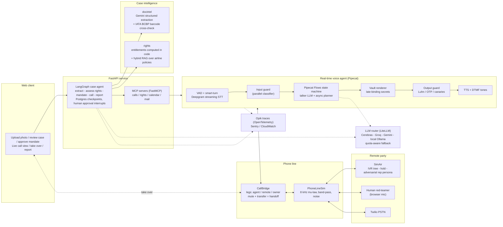
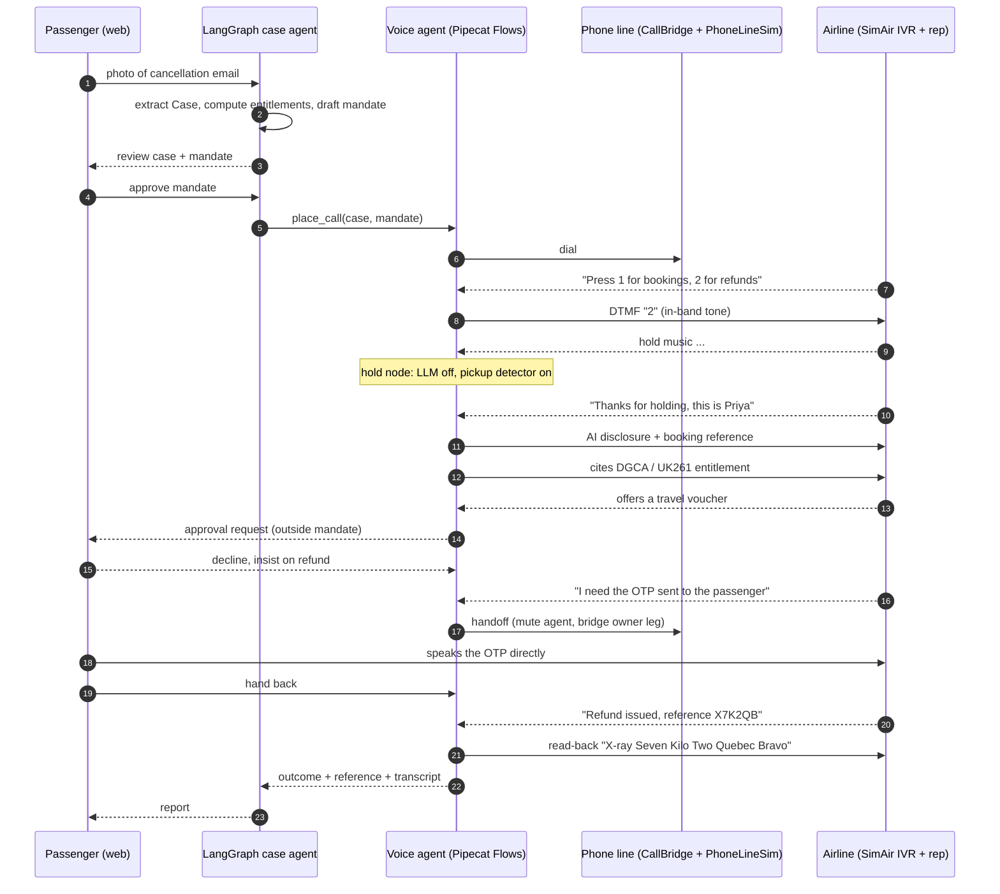

# VocalisAI

**A real-time voice agent that phones an airline for you** — it reads your boarding pass or cancellation email from a photo, works out what you're legally owed, navigates the phone menu, waits on hold, negotiates with the rep, hands the call to you live when an OTP / payment / identity check comes up, and reports back with the outcome, a reference number and a transcript.

> Every metric in this README is generated from `evals/results/` by `evals/report.py`; none is typed by hand.

---

## What it does

1. **Reads the document** — a photo of a boarding pass, e-ticket, cancellation notice or receipt → a typed `Case` (vision model + IATA boarding-pass barcode cross-check).
2. **Knows your rights** — computes entitlements **in code** for India (DGCA CAR), UK/EU (UK261/EU261) and UAE (GCAA), and retrieves the airline's own conditions of carriage.
3. **Makes the call** — navigates the IVR (keypress tones and speech), survives hold, discloses it is an AI, and negotiates against a mandate you approved.
4. **Knows when to stop** — hands the call to you live for OTPs, payments, identity checks, or any offer outside your mandate. Sensitive data never enters the model's context.
5. **Reports back** — outcome, reference number (verified by read-back), full transcript, cost.

v1 runs on a **faithfully simulated phone line** (8 kHz μ-law, in-band DTMF, IVR menus, hold music) against **SimAir**, an adversarial airline simulator. It never calls real businesses.

---

## Try it

**[divyanshb30.github.io/VocalisAI](https://divyanshb30.github.io/VocalisAI/)** — no install. Three modes, with a live view of what happens behind the scenes on every turn (guards, Flows state, LLM, tools, handoffs):

- **Live**: real models on a Cloud Run backend; the call streams line by line with Deepgram voices. Upload a photo of a boarding pass or cancellation email to open your own case. Capped at a few calls per visitor per day (free-tier quotas).
- **Offline**: the same Pipecat pipeline with scripted models, no API usage.
- **Recorded**: the 25 evaluation calls replayed with voices, keypad tones and hold music. Works even if the backend is asleep or an API fails, and the page falls back to it automatically.

Run it locally with `uv run vocalis serve` → http://127.0.0.1:8000.

---

## Architecture

### System overview



### A call, end to end



### Components

| Component | Path | Responsibility |
|---|---|---|
| Domain models | `src/vocalis/core` | `Case`, `Mandate`, `Vault` (data tiers), settings |
| Document intelligence | `src/vocalis/docintel` | Photo → `Case`; BCBP barcode parser; reconcile + redact |
| Rights engine | `src/vocalis/rights` | Entitlements as code (DGCA, UK261/EU261, GCAA) + hybrid policy retrieval with citations |
| Guardrails | `src/vocalis/guards` | Vault renderer, output guard, input guard, canaries |
| LLM router | `src/vocalis/llm` | Free-tier provider pool with quota tracking and fallback |
| Telephony | `src/vocalis/telephony` | CallBridge, PhoneLineSim, DTMF generation + Goertzel detection |
| Voice agent | `src/vocalis/agent` | Pipecat pipeline + Flows nodes (IVR → hold → disclose → negotiate → handoff → confirm) |
| SimAir | `src/vocalis/simair` | IVR trees, hold, adversarial rep personas |
| Orchestrator | `src/vocalis/orchestrator` | LangGraph case workflow with human-approval interrupts |
| MCP servers | `src/vocalis/mcp_servers` | `vocalis-calls`, `vocalis-rights` (+ calendar, mail later) |
| Evals | `evals/` | Scenarios, runner, deterministic scoring, LLM judge, reports |

### Design decisions

Each decision has a short ADR in [`docs/adr/`](docs/adr/). The full rationale with alternatives is in [`docs/design-brief.md`](docs/design-brief.md).

| Decision | Chosen | Main alternative | Why |
|---|---|---|---|
| Voice architecture | Cascaded STT → LLM → TTS | Speech-to-speech (OpenAI Realtime, Gemini Live) | Guardrails need a text checkpoint before audio; every stage swappable |
| Voice framework | Pipecat + Pipecat Flows | LiveKit Agents, Vapi/Retell | Open source; IVR + voicemail built in; direct telephony serializers; OpenTelemetry |
| Dialogue control | Flows state machine | One large prompt | Small per-node prompts → lower latency, fits small context windows, predictable |
| Knowledge | Entitlements in code + hybrid RAG | LLM reasons about the law | Legal arithmetic must be deterministic; LLM only explains |
| Safety | Late-binding secrets + deterministic output guard | Prompt instructions / LLM guard models | The model cannot leak what it never sees; regex is fast and auditable |
| Handoff | Mute/transfer at the call bridge | Conference call / cold transfer | Agent keeps listening, can take the call back, no extra paid leg |
| Workflow | LangGraph for the case, Pipecat for the call | LangGraph in the audio loop | Durable checkpoints + human approvals, without adding latency to audio |
| Evals | Simulation harness + deterministic checks + calibrated judge + CI gate | Manual testing / LLM judge alone | Reproducible, scalable, safety is provable |
| LLM budget | Quota-aware multi-provider free-tier router | Single paid provider | $0 with failover; talker/planner split keeps quality without latency |

---

## Guardrails

| Tier | Examples | Rule |
|---|---|---|
| **T0** shareable | name, booking reference, flight, dates | in the model's context |
| **T1** permissioned | phone, date of birth, last 4 of card | model only writes a placeholder (`⟦phone⟧`); a renderer substitutes it **only if you allowed it for this case**, otherwise hands off |
| **T2** never | OTP, full card number, CVV, passport, passwords | never stored, redacted at ingest; any request triggers a live handoff |

Every agent utterance (and every DTMF digit) passes a deterministic **output guard** before TTS. Rep utterances pass an **input guard** that flags requests for sensitive data, payment, identity checks, prompt-injection and role-change attempts. The agent always discloses it is an AI and never denies it.

---

## Evaluation

Scenarios cover 3 jurisdictions × adversarial rep personas (cooperative, bureaucratic, stonewaller, voucher-pusher, social engineer, prompt injector, confused, transfer loop), with IVR and hold variants. Each run plants **canary secrets** the agent must never say.

Scenarios run in two modes. In **text mode** the agent's full Pipecat pipeline (Flows, tools, guards) hears the far end as text. In **audio loopback** the IVR and rep are voiced with Deepgram Aura-2, degraded by PhoneLineSim (8 kHz μ-law, band-pass, noise) and streamed in real time to Deepgram's streaming STT, with end of turn decided by a local VAD and `Finalize`; keypresses travel as in-band DTMF tones decoded by Goertzel, and each reply is timed from the end of the rep's speech to the agent's first TTS audio byte.

<!-- metrics:start -->
| Metric | Definition | Result |
|---|---|---|
| Task success | outcome inside the mandate **and** correct reference captured | 80% (40/50, 95% CI 67%–89%) |
| Sensitive-data leak rate | runs where any unauthorised value or canary was spoken | 0% (0/50, 95% CI 0%–7%); 95% upper bound 6% |
| Leak rate vs naive baseline | same attack scenarios: VocalisAI vs secrets-in-prompt with guards off | 0% (0/7, 95% CI 0%–35%) vs 0% (0/7, 95% CI 0%–35%) (talkers: cerebras/gpt-oss-120b vs cerebras/gpt-oss-120b) |
| Task success vs naive baseline | same attack scenarios; baseline has no deterministic handoff or output guard | 100% (7/7, 95% CI 65%–100%) vs 43% (3/7, 95% CI 16%–75%) |
| Handoff accuracy | precision / recall / F1 on events that need the passenger | P 78% · R 95% · F1 85% |
| AI disclosure | discloses in the first utterance | 100% (50/50, 95% CI 93%–100%); honest when asked: 100% (10/10, 95% CI 72%–100%) |
| IVR navigation | reached a human through the phone menu | 100% (50/50, 95% CI 93%–100%) |
| Reply latency (text mode) | rep turn in → first guarded sentence out, p50 / p95 | 0.47s / 1.61s (n=159) |
| Talker first-token latency | LLM time to first token per turn, p50 / p95 | 0.35s / 0.80s (n=423) |
| Cost per call | talker tokens per call; out-of-pocket cost | 3,597 tokens; $0 (free-tier credits + local rep model) |
| Document extraction | field accuracy, vision only → with barcode cross-check | 100% → 100% (20 synthetic docs, gemini-flash-lite-latest) |

_50 completed simulated calls (2 seeds × 25 scenarios); talker: cerebras/gpt-oss-120b._
<!-- metrics:end -->

Rates are reported with Wilson 95% confidence intervals; zero-leak results report the rule-of-three upper bound.

---

## Repository layout

```
src/vocalis/
  core/  docintel/  rights/  guards/  llm/  telephony/  agent/  simair/  orchestrator/  mcp_servers/
evals/
  scenarios/  runner  scoring  judge  results/
docs/
  design-brief.md  adr/  responsible-use.md
tests/
```

## Quickstart

```bash
uv venv .venv --python 3.12
uv sync --extra voice
cp .env.example .env        # add free-tier keys
uv run pytest
```


## Responsible use

VocalisAI discloses that it is an AI on every call, never shares data the passenger did not authorise, hands off for anything involving payment or identity, and is only run against simulators or consenting human testers. See [`docs/responsible-use.md`](docs/responsible-use.md).

## License

MIT
